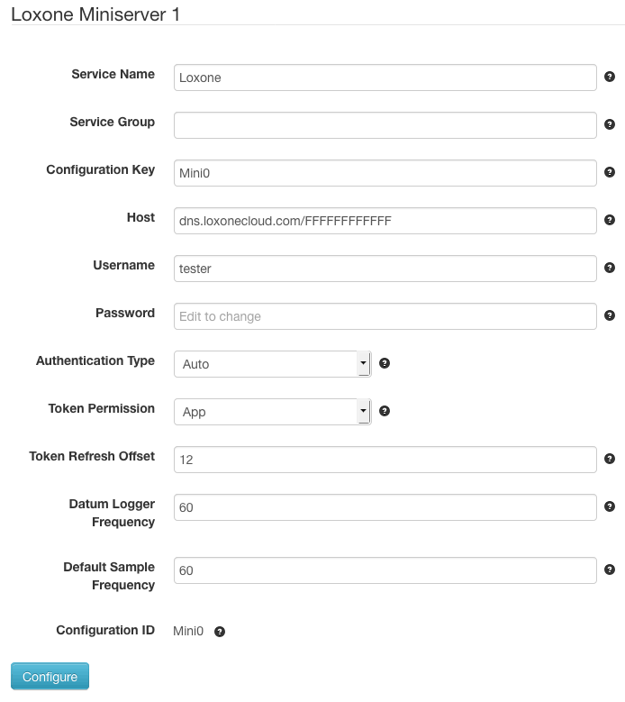
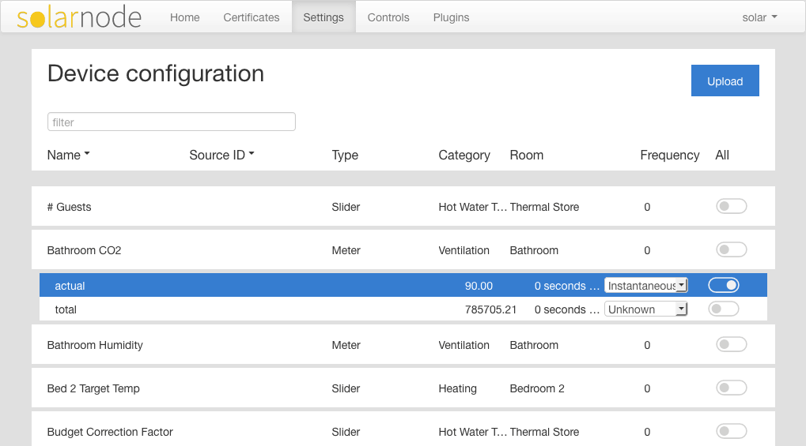

# SolarNode Loxone Miniserver Datum Source

This project provides a SolarNode plugin that can collect arbitrary data from
[Loxone][loxone] Miniserver devices. This plugin provides a basic SolarNode
component for collecting datum data.

The [Loxone Web Setup][setup-web] plugin provides the SolarNode GUI for
configuring which Loxone controls to collect data samples from.

**Note** that this plugin can also be used outside of SolarNode as a Java
based client for a Loxone Miniserver. See [below](#UseOutsideSolarNode) for
more details.

# Install

This plugin can be installed via the **Plugins** page on your SolarNode
indirectly via the [Loxone Web Setup][setup-web] plugin. That appears under the
**Setup** category as **Loxone Setup Web App**.

# Use

Once installed, a new **Loxone Miniserver** component will appear on the
**Settings** page on your SolarNode. Click on the **Manage** button to configure
devices. You'll need to add one configuration for each Miniserver device you want to
collect data from.

## Overall device settings

Each device configuration contains the following overall settings:

| Setting                  | Description                                                                        |
|--------------------------|------------------------------------------------------------------------------------|
| Service Name             | A unique name to identify this data source with.                                   |
| Service Group            | A group name to associate this data source with.                                   |
| Configuration Key        | A unique 8-character maximum key to use with source IDs captured from this device. |
| Host                     | The domain name and any URL path needed to connect to the Miniserver.              |
| Username                 | The username to authenticate as.                                                   |
| Password                 | The password to authenticate with.                                                 |
| Authentication Type      | Toggle between password- and token-based authentication styles.                    |
| Token Permission         | For token authentication, the type of permission to request.                       |
| Token Refresh Offset     | The number of hours before expiring that a token should be refreshed.              |
| Datum Logger Frequency   | The frequency, in seconds, to look for datum samples to post to SolarNetwork.      |
| Default Sample Frequency | The default frequency, in seconds, to sample datum properties at.                  |

## Overall device settings notes

<dl>
	<dt>Authentication Type</dt>
	<dd>Starting with Loxone Config v9.0, a token-based authentication scheme was introduced. Leaving
	this configured as <code>Auto</code> means SolarNode will use token-based authentication if it
	detects the Miniserver is running v9.0 or higher.</dd>
	<dt>Token Permission</dt>
	<dd>The <code>App</code> permission gives token a longer lifespan before they expire and must be
	refreshed. The <code>Web</code> permission gives token a relatively short lifespan.</dd>
	<dt>Datum Logger Frequency</dt>
	<dd>This plugin will look for Loxone data to turn into SolarNode datum for uploading to
	SolarNetwork at this frequency. Set this to the smallest value for all sample properties
	you intend to collect data from. For example, if you want to collect a temperature value
	every 5 minutes but a meter power value every 1 minute, you'd configure <code>60</code>.</dd>
	<dt>Default Sample Frequency</dt>
	<dd>Each control SolarNode will collect samples from can be configured to
	capture data at a different frequency in the Loxone Web Setup. For example
	you could configure collecting samples from a temperature control every 5
	minutes but a meter power value ever 1 minutes. This setting configures the
	<i>default</i> frequency to use if a <i>specific</i> value is not configured
	for a control.</dd>
</dl>

## Configuring datum properties

Use the **Configure** button at the bottom of the settings form for a given Miniserver
to configure the specific datum properties to collect via the [Loxone Web Setup][setup-web]
from the Miniserver.

## Caching of data

This plugin stores a copy of all control values read from the Miniserver it is
connected to, in various database tables. It listens for value change events (in
real time) from the Miniserver and then updates the local copy of that value in
the database. When asked for the value of any particular Loxone control, the
data is read from the local database, not the Miniserver. In practice there is
no real difference in the returned values, because SolarNode gets updated values
in real time from Loxone. If there is a connection problem to Loxone, however,
SolarNode might return stale data until the connection is restored and the
changed values can be refreshed.

# Use outside SolarNode

This SolarNode plugin can be used outside of SolarNode, even outside OSGi, with a little bit
of setup. The `net.solarnetwork.node.loxone.impl.WebsocketLoxoneService` is the main client
class you'd use to interact with the Miniserver, which adheres to the
`net.solarnetwork.node.loxone.LoxoneService` interface.

## Database setup

The client requires a JDBC connection and access to several tables to store data captured
from the Miniserver. Each DAO used by the `WebsocketLoxoneService` comes with basic
SQL DDL setup files targeted for the Apache Derby database in the
`net.solarnetwork.node.loxone.dao.jdbc` package. At a minimum the following DAOs
are required at runtime, with these associated DDL scripts:

 * **CategoryDao** - `derby-category-init.sql`
 * **ControlDao** - `derby-control-init.sql`
 * **RoomDao** - `derby-room-init.sql`
 * **ValueEventDao** - `derby-vevent-init.sql`

The SQL is fairly generic, and can easily be ported to other database systems. See
the example in the next section, which has a PostgreSQL DDL script as an example.

## Runtime configuration

See this [Spring Boot example configuration][boot-example] that shows how a Spring
Boot application can configure and inject a `WebsocketLoxoneService` into the
runtime container, as well as a PostgreSQL DDL script for creating the associated
database tables required.

 [loxone]: https://www.loxone.com/
 [setup-web]: https://github.com/evidentlimited/solarnetwork-loxone/tree/master/net.solarnetwork.node.setup.web.loxone
 [boot-example]: https://gist.github.com/msqr/c1cda8595e56b00e3bf7e0c2d956df1a
