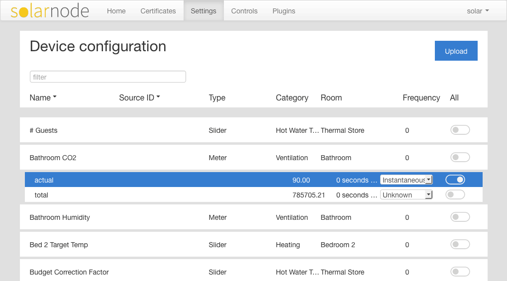

# SolarNode Loxone Miniserver Datum Source Web Setup

This project provides a SolarNode plugin for configuring what data to
collect from [Loxone][loxone] Miniserver devices. It works with the
[Loxone Datum Source][loxone-hw] plugin.

# Install

This plugin can be installed via the **Plugins** page on your SolarNode via the
[Loxone Web Setup][setup-web] plugin. That appears under the **Setup** category
as **Loxone Setup Web App**.

# Use

Once installed, a new **Loxone Miniserver** component will appear on the
**Settings** page on your SolarNode. Click on the **Manage** button to configure
devices. You'll need to add one configuration for each Miniserver device you
want to collect data from. See the [Loxone Datum Source][loxone-hw] plugin
documentation for configuring the Miniserver connection settings.

Then use the **Configure** button at the bottom of the settings form for a given
Miniserver to configure the specific datum properties to collect via the GUI
provided by this plugin.

## Property sample settings

The Loxone GUI will display all available controls from the connected Miniserver.
Each control you'd like to collect as a datum property must be enabled via the
toggle on the right of each control. Then configure the datum property type as
`Instantaneous`, `Accumulating`, or `Status`. Finally configure a custom frequency
if desired. If the frequency is left as <code>0</code>, then the
**Default Sample Frequency** value from the [Loxone Datum Source][loxone-hw]
setting will be used.

## Customized Source IDs

By default the SolarNetwork source ID for each control property will be derived
automatically as `/ConfigKey/ControlKey` where `ConfigKey` is the
**Configuration Key** value from the [Loxone Datum Source][loxone-hw] setting
and `ControlKey` is the control name, with spaces removed.

This can be customized by uploading the Loxone XML configuration file for the
Miniserver. Then the source IDs will be derived from the user-defined title of
each control, with `_` characters replaced with `/`.

For example, if a Loxone XML configuration contained the following:

		<C Type="Page" V="110" U="0e2a1f46-0380-2778-ffffa1b98ee6c71d"
			Title="Test_1wire" WF="16384"/>

then the derived control name would be `Test/1wire`.

 [loxone-hw]: https://github.com/evidentlimited/solarnetwork-loxone/tree/master/net.solarnetwork.node.hw.loxone
